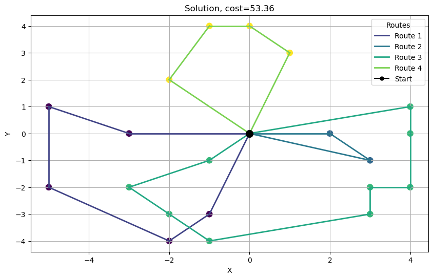

Szymon Wysogląd
# Model danych, postać rozwiązania i funkcja celu

W wersji naszego algorytmu korzystamy z miejsc dostaw, które mają postać punktów o współrzędnych ```x``` oraz ```y```. Te wartości byłyby ściągane z pliku csv. Do ich przechowywania byłaby klasa ```Node```, która ma dwa atrybuty ```x``` oraz ```y``` oraz kilka funkcji definiujących dodawanie, odejmowanie oraz odległości między punktami. Przyjęliśmy taką formę dla prostszej wizualizacji otrzymanego rozwiązania, ponieważ w przypadku macierzy sąsiedztwa nie byłoby to tak widoczne na wykresie.

Każdy kierowca ma swoją trasę, która jest listą punktów dostaw. Stworzyliśmy klasę ```DeliveryRoute```, która właśnie przechowuje taką listę, ale ma również zaimplementowane metody dodawania oraz usuwanie punktów, tak aby punkty dostaw w obrębie jednego kierowcy układały się w optymalny sposób rozwiązując pojedynczy problem komiwojażera. Pojedyncza operacja dodania wierzchołka ma złożoność ```O(n)```, gdzie ```n``` to liczba wierzchołków aktualnie w trasie kuriera, natomiast usuwanie wierzchołka jest w czasie stałym ```O(1)```. Dodatkowo każda struktura przechowuje informację o współrzędnych magazynu.

Każda solucja jest określona jako klasa ```RoutePlaner```, która przechowuje listę tras dla każdego kierowcy, a także informacje o kosztach, zyskach oraz innych parametrach.

Aktualnie funkcje celu są zdefiniowane jako sumaryczna długość trasy, jednak będą dodatkowe "kary" za zbyt długie trasy, ograniczenia czasowe oraz koszt pojemności samochodu. 

Algorytm ArtificialBeeColony będzie na początku losował rozwiązania, a następnie będzie je poprawiał, aż do osiągnięcia zadowalającego wyniku.


## Algorytm ABC - Artificial Bee Colony

```python
# from src.RoutePlaner import RoutePlaner
from src.Node import Node
# from src.DeliveryRoute import DeliveryRoute
import numpy as np
from src.ABC_algorithm import artifical_bee_colony_algorithm
np.random.seed(32)
node_count = 20
courier_count = 4
a, b = -5, 5

start = Node(0,0)
nodes = [Node(np.random.randint(a,b), np.random.randint(a,b)) for _ in range(node_count)]
#remove duplicates
nodes = list(dict.fromkeys(nodes))
sol = artifical_bee_colony_algorithm(courier_count, nodes, start, bp=100, mcn=1000, p=10, employed_bees_ratio=0.5)
sol.plot_solution()
```

<div style="text-align: center;">
  
</div>